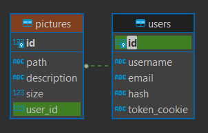
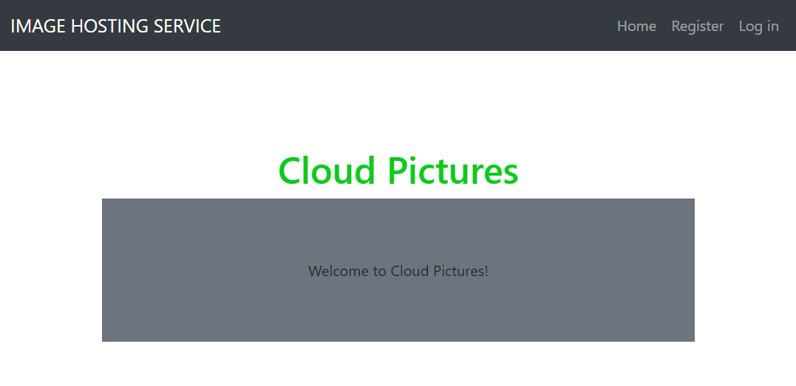
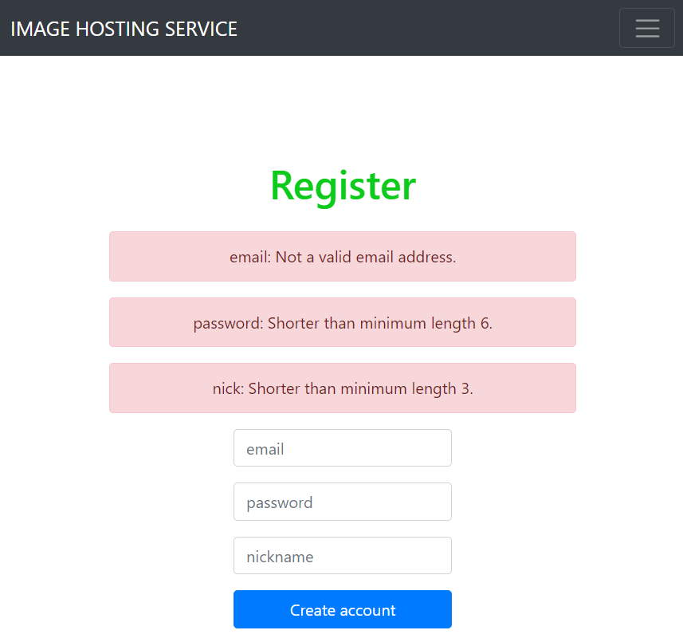
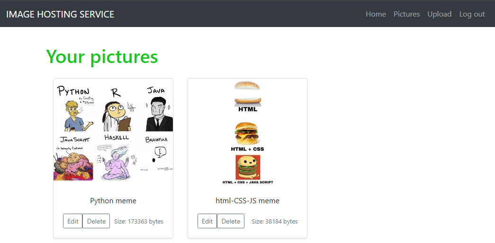

# Image hosting app (Flask)

## Description

Web application for hosting pictures of user on **Flask**, with following features:

- The app has a very simple front-end part (but not so poor back-end) basen on HTML templates rendered by `Jinja2` (
  without fully adaptive layout)

- Data is stored using **SQLite** DB (created and managed using `flask_sqlalchemy` and `flask_migrate`). ER Diagram of
  the DB model:



- The app has full **CRUD** functionality for viewing and managing the pictures
- Validation of the input data during the registration and log in is implemented
  using [`marshmallow`](https://marshmallow.readthedocs.io/en/stable/)
- User's password is stored in encrypted way (**hash** column in the **User** table). Encryption is done
  with [`bcrypt`](https://pypi.org/project/bcrypt/):

```python
hashed = bcrypt.hashpw(password.encode('utf-8'), bcrypt.gensalt(rounds=10))
```

- Uploaded pictures are stores statically in a corresponding to the user folder:


- "remember me" function is implemented using cookies (`response.set_cookie`)

## Examples of different pages

- Index page:



- Example of the input data validation:



- Pictures of a user:



- Upload page:


- Page with editing the description of the picture:


**_Kravchenko Michail_**
